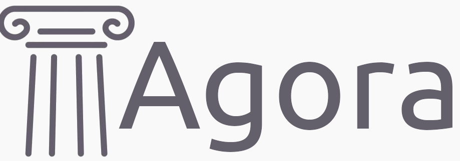

A confidentiality-first electronic voting system.

## About

Agora is a voting platform based on the [Ethereum](https://ethereum.org/en/) public blockchain and a [Zero-Knowledge Proof](https://zkp.science/) cryptographic protocol.

Consult the technical documentation in the [wiki](https://github.com/nova-collective/agora/wiki) of the project: 

* [Agora functional analysis](https://github.com/g3k0/agora/wiki/2.-Functional-analysis)
* [Agora technical analysis](https://github.com/g3k0/agora/wiki/3.-Technical-analysis)

Agora is a web3 dApp based on the [Hardhat framework](https://hardhat.org/) and the [Alchemy SDK](https://www.alchemy.com/). Consult the documentation.

## Prerequisites

In order to run the application you need the following software installed on you machine:

* [Node.js](https://nodejs.org/en) v20.11.1 or above

You also need an Alchemy account.

## Setup

To setup the application follow these steps:

1. clone this repository
2. from the root folder of the application run: `npm i`
3. run `npm run prepare`
4. Write a `.env` file in the root of the project and configure:
    * `SEPOLIA_URL` You can find the data in your Alchemy account, after you create an app there;
    * `ALCHEMY_PRIVATE_KEY` You can find the data in your Alchemy account;
    * `REPORT_GAS` enable or disable the gas report on smart contracts unit tests executions;
    * `NODE_ENV` set `development` for your local machine;

## How to commit

The `main` and the `develop` branches are protected. It is required to open and review pull requests in order to merge the code.

Since the development of this project is planned, if you are considering to open a Pull Request please contact first the maintainer of the code at:

`nova.web3.collective@gmail.com`

To commit:

1. `git add <files list>`
2. `npm run commit`

Remember to follow this convention for commit messages: `AG-<jira id> <description>`, this allows to link the commit to its ticket in the Jira board.

## Test

1. Run the unit tests for smart contracts: `npm run test-contracts`
2. Run the unit test code coverage for smart contracts: `npm run coverage-contracts`
3. Run the unit test for scripts: `npm run test-scripts`

Smart contracts code coverage documentation [here](https://www.npmjs.com/package/solidity-coverage).

CI/CD workflow fails if the unit test code coverage threshold (**80% of lines of code**) for scripts is not met. 

## Run the localhost development network

Hardhat framework provides a local blockchain network that lives in memory, that is useful to test local developments.
To start the network run the command:

`npm run node:start`

## Compile the smart contracts

Run the command: `npm run compile`

## Deploy the smart contract

The smart contracts deploy process is managed, under the hood, by [Ignition](https://hardhat.org/ignition/docs/getting-started#overview).

To deploy smart contract instances run the command:

`npm run deploy-contract <ignition-module-path> <network>`

Ignition will deploy the instances of the smart contract following the logic specified in the ignition module.

To deploy to a specific network (e.g. mainnet, sepora), the network must be configured in the `hardhat.config.ts` file.

For the local network the parameter to pass is `localhost`, there is no need to configure the local network.

## Emulate the whole process using the scrips

### Prerequisites

* Edit the scripts mocks file: `election-scripts/__mocks__.ts`;
    * edit the municipality election contract data, in particular registrationStart and registrationEnd are timestamps in seconds;
    * edit the data of the parties and candidates as you prefer;
    * edit the data of the Voter as you prefer;
* Compile the smart contracts in order to produce the artifacts: `npm run compile`;
* Creates the `typechain-types` folder with the command: `npx hardhat typechain`; 
* start the local network (unless you want to run the scripts on Sepolia): `npm run node:start`;

### 1. The Public Authority / Admin creates the DECs Registry
For the creation of the registry we deploy the DECs Registry smart contract:

`npx hardhat run election-scripts/create-decs-registry.ts --network localhost`;

Take note of the contract address returned by the script;

### 2. The Public Authority / Admin creates the EOA for the Voter
If you are using the local network, you can skip this step and just take note of one EOA returned by the start of the local network.

Execute the `create-voter` scripts and take note of the resulting `address` and `privateKey`:

`npx hardhat run election-scripts/create-voter-eoa.ts`
 
### 3. The Public Authority / Admin creates the DEC for the Voter and register the DEC into the DECs Registry
in the `election-scripts/create-dec.ts` file, insert the Voter's private key and save the file.
Then, deploy the contract encrypting the Voter's data with the command:

`npx hardhat run election-scripts/create-dec.ts --network localhost`

Take note of the DEC contract address returned by the script;

### 4. The Public Authority / Admin registers the Voters DECs on the DECs Registry
Write in the `__mock__.ts` file the data required in the `DECsRegistryData`. The data are retrieved by the previous scripts.
Then run the script in order to register the Voter DEC into the DECsRegistry:

`npx hardhat run election-scripts/register-dec.ts --network localhost`

### 5. The Public Authority / Admin creates a Municipality Election
At this point we have the EOA credentials and the DEC for our voters, and the DECs are registered on the DECs Registry. It's time to create an election: as an example we implemented a smart contract for a municipality election, that elects the major and the council.

Now it's time to deploy the smart contract election and register parties, councilor and major candidates, parties coalitions in the municipality election contract, run the command:

`npx hardhat run election-scripts/create-election.ts --network localhost`

Please note that to make the registration of parties and coalition working, the functions must be called in the registration period set before.

## Donations
Support this project and offer me a crypto-coffee!!

"Crypto? No way..."

No problem, there is the related [crowdfunding campaign](https://www.gofundme.com/f/agora-sistema-di-voto-basato-su-blockchain) (in italian):

